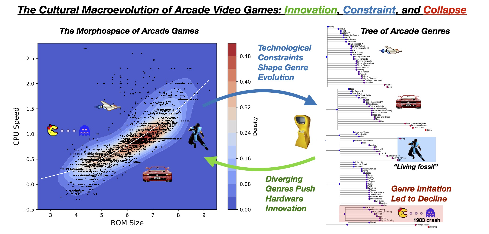

# The Cultural Macroevolution of Arcade Video Games

This repository contains data and code for the paper:

**"The Cultural Macroevolution of Arcade Video Games: Innovation, Collaboration, and Collapse"**  
_Sergi Valverde, Blai Vidiella, Andrej Spiridonov, and R. Alexander Bentley_  
[Published in *Evolutionary Human Sciences*](https://www.cambridge.org/core/journals/evolutionary-human-sciences/article/cultural-macroevolution-of-arcade-video-games-innovation-collaboration-and-collapse/B3FC4F20D03368F24E47553FA0E8173A)

We analyze over 7,000 arcade video games using structured metadata from the MAME emulator project (https://www.mamedev.org) to study how cultural genres emerge, evolve, and collapse over time.

## 📊 Graphical Abstract

This figure summarizes the main findings of our paper.

## 📂 Repository Contents

- `data/`: Cleaned arcade dataset (`arcade.csv`) and compressed raw MAME metadata (`database.xml.zip`)
- `code/`: Python notebooks for figure generation
- `sm/`: Supplementary plots from the paper

## 📊 Reproducing the Analysis

1. Install Python 3 and the following packages:  
   `pandas`, `numpy`, `matplotlib`, `seaborn`, `scipy`, `jupyter`
2. Open the notebook for each figure, e.g:   
   `code/fig1.ipynb`

## 📜 License

This project is licensed under the MIT License. See `LICENSE` for details.

## 📌 Citation

If you use this code or data, please cite:

> Valverde, S., Vidiella, B., Spiridonov, A., & Bentley, R.A. (2025). *The Cultural Macroevolution of Arcade Video Games: Innovation, Collaboration, and Collapse*. Evolutionary Human Sciences.
